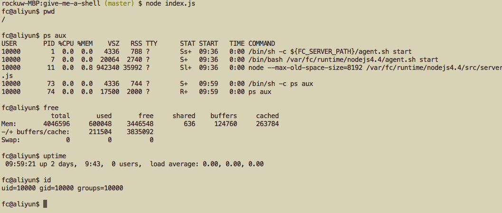

# Give me a shell, I can...

Instantly run a linux shell in the cloud as your need, discard it when
you're done.

Powered by Aliyun [FunctionCompute](https://www.aliyun.com/product/fc)



For the web version, see: https://github.com/awesome-fc/give-me-a-shell-web

## Example

```
git clone https://github.com/awesome-fc/give-me-a-shell
cd give-me-a-shell

export REGION='region'
export ACCOUNT_ID='account id'
export ACCESS_KEY_ID='access key id'
export ACCESS_KEY_SECRET='access key secret'
export SERVICE_NAME='service name'
export FUNCTION_NAME='function name'

node index.js

```

## TODO

- [ ] commands auto completion
- [ ] streaming output(e.g. ping)
- [ ] provide usage statistics
